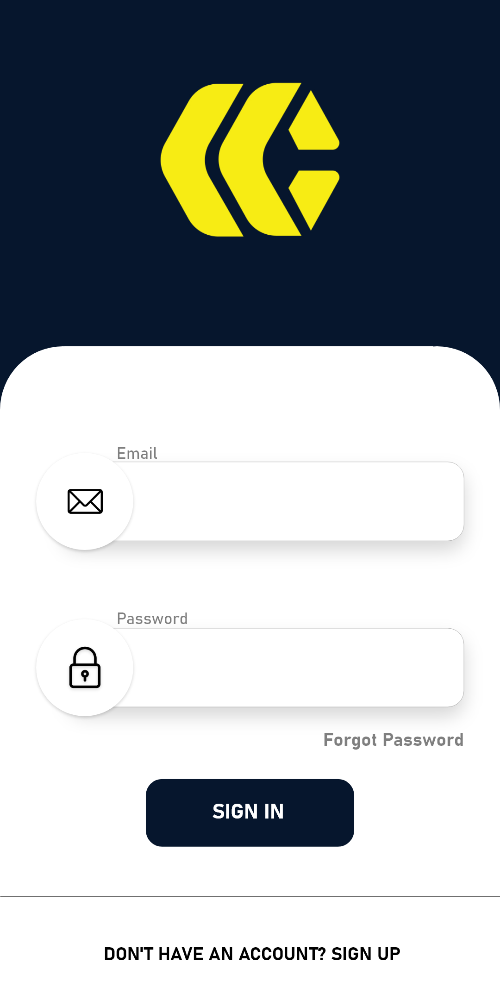
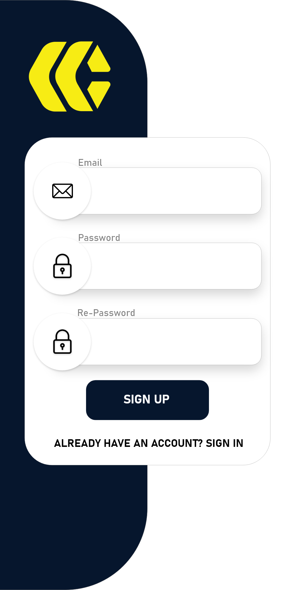
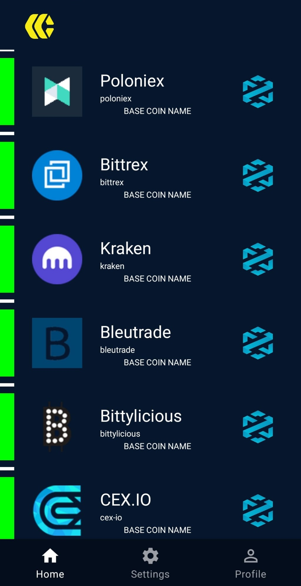
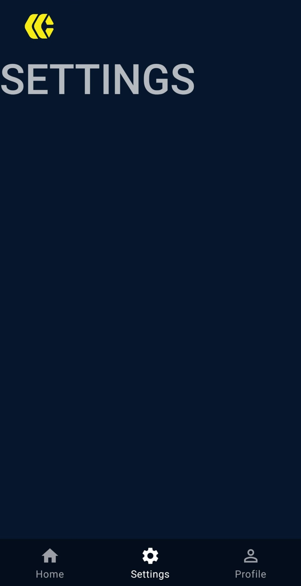

<h1 align="center"> Coin Market App </h1>

Application that lists newly released coins

<h2> Splash Screen </h2>

  

<h2> Login - Register Screen </h2>

   
  

<h2> Home- Settings - Profile Screen </h2>

  
  
  

<!--Splash Screen             
:-------------------------:
  

Login Screen           |  Register Screen
:-------------------------:|:-------------------------:
  |  

Home Screen             |  Settings Screen 
:-------------------------:|:-------------------------:
  |  

Profile Screen             
:-------------------------:
  -->

<!--
<h2> Splash Screen </h2>

<h2> Login Screen </h2>

<h2> Register Screen </h2>

<h2> Home Screen </h2>

<h2> Settings Screen </h2>

<h2> Profile Screen </h2>
-->
